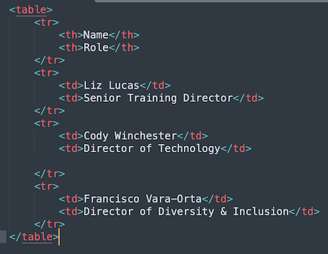

# ire24-R-web-scraping
The basics of scraping web pages in R using rvest

### Basics of HTML structure
Get to know the structure of an HTML element - [https://developer.mozilla.org/en-US/docs/Glossary/Element](https://developer.mozilla.org/en-US/docs/Glossary/Element)
	
   - tags  `ex: 
 opens and 
 closes`
   - attributes `ex: id="shazam" inside the tag 
`
   - text `ex: 
The text between opening and closing tags
`

A table built into HTML:
